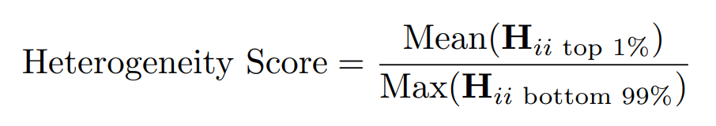
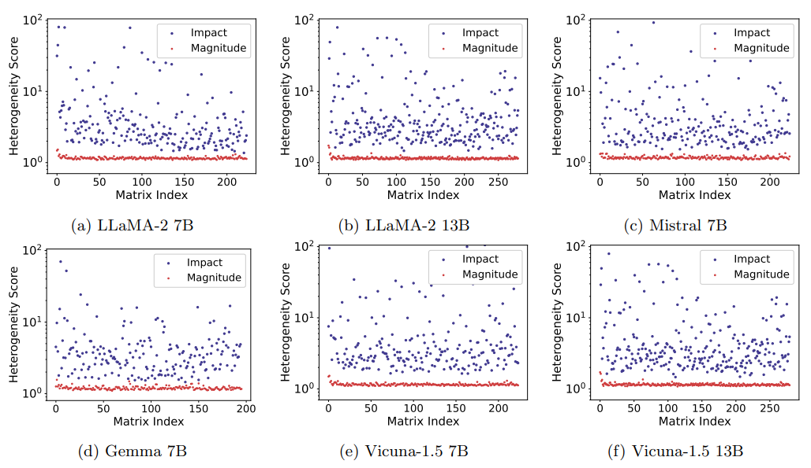

# CherryQ

[](https://github.com/tatsu-lab/stanford_alpaca/blob/main/LICENSE)
[](https://github.com/tatsu-lab/stanford_alpaca/blob/main/DATA_LICENSE)
[](https://www.python.org/downloads/release/python-3100/)

This is the repository for [Cherry on Top: Parameter Heterogeneity and Quantization in
Large Language Models](https://arxiv.org/pdf/2404.02837.pdf).

## <a id="overview"></a>Overview

This work reveals the phenomenon of parameter heterogeneity in large language models (LLMs). The heterogeneity lies in that a small subset of ”cherry” parameters exhibit a disproportionately large impact on model performance, while the vast majority of parameters have minimal impact. By utilizing this heterogeneity that is prevalent across different model families, scales, and types, CherryQ is proposed to identify and preserve the critical cherry parameters in high precision while aggressively quantizing the remaining parameters to low precision. It empirically outperforms existing quantization approaches in terms of perplexity and downstream task performance.

<p align="center" width="100%">
<a></a>
<a></a>
</p>

## Installation

### Create conda environment
```Bash
conda create -n cherryq python=3.10 && conda activate cherryq
``` 

### Install dependencies
```Bash
pip install -r requirements.txt
```

## Data preparation

Enter the `data` directory and:

### 1. Download data into `data/raw_data`
Run the following command:
```Bash
bash download_data.sh
```

### 2. Preprocess (format and tokenize data samples)
For base model (we use C4 as our calibration dataset), run the following command:
```Bash
python preprocess.py \
    --model-path NousResearch/Llama-2-7b-hf \
    --in-file raw_data/base \
    --out-dir processed_data/c4_processed_50k
```

For chat model (we use ShareGPT as our calibration dataset), run the following command:
```Bash
python preprocess.py \
    --model-path lmsys/vicuna-7b-v1.5 \
    --model-id vicuna_v1.1 \
    --in-file raw_data/chat \
    --out-dir processed_data/sharegpt_processed_20k
```

## Estimate parameter impact on model performance
To obtain the cherry indices that have the highest impact on model performance, run the following command:
```Bash
python estimate_impact.py \
    --base_model <model to be estimated, e.g. NousResearch/Llama-2-7b-hf> \
    --data_path <processed calibration dataset, e.g. data/processed_data//c4_processed_50k> \
    --output_file <produced cherry indices file, e.g. data/cherry_indices/llama2-7b-impact.pt>
```

## Training

For all LLM scales (7B, 13B), and both base models and chat models (LLaMA2, Vicuna-v1.5), we train the models on a single node with 8 x A800 80GiB GPUs. We use a total batch size of 128, a learning rate of 2e-5, a weight decay of 0.0, a cosine scheduler with 5% warm-up steps. The rest of hyperparameter used in training across different models are as follows:

| Model & bit | num_epochs | micro_batch_size | gradient_accumulation_steps | min_warmup_ratio |
| :--- | :---: | :---: | :---: | :---: |
| LLaMA2-7b 3bit | 1 | 8 | 2 | 0.25 |
| LLaMA2-7b 4bit | 1 | 8 | 2 | 0.1 |
| LLaMA2-13b 3bit | 1 | 4 | 4 | 0.25 |
| LLaMA2-13b 4bit | 1 | 4 | 4 | 0.1 |
| Vicuna-v1.5-7b 3bit | 2 | 8 | 2 | 0.25 |
| Vicuna-v1.5-13b 3bit | 2 | 4 | 4 | 0.25 |

Here is a sample training command:
```Bash
bash run_train.sh
```

You may modify `micro_batch_size` and `gradient_accumulation_steps` to better accommodate your machine.


## Evaluation

We provide a script for evaluating the perplexity results on two widely-used corpora: C4 and WikiText-2:
```Bash
python evaluate_perplexity.py \
    <tokenizer name or path, e.g. NousResearch/Llama-2-7b-hf> \
    <directory where the model checkpoints are written>
```

Here are the main results of CherryQ on C4 and WikiText-2 across different model scales and
different group sizes. For more training and evaluation details, please refer to our [paper](https://arxiv.org/pdf/2404.02837.pdf).

### 3bit quantization on LLaMA2 models

| Method       | 7B-3bit-g128 c4 | 7B-3bit-g128 wiki2 | 7B-3bit-g64 c4 | 7B-3bit-g64 wiki2 | 13B-3bit-g128 c4 | 13B-3bit-g128 wiki2 | 13B-3bit-g64 c4 | 13B-3bit-g64 wiki2 |
|:--------------|------------------|---------------------|----------------|-------------------|------------------|----------------------|-----------------|--------------------|
| FP16         | 6.97             | 5.47                | 6.97           | 5.47              | 6.47             | 4.88                 | 6.47            | 4.88               |
| QAT          | 9.25             | 6.90                | 8.74           | 7.13              | 7.19             | 5.63                 | 7.02            | 5.48               |
| GPTQ         | 8.28             | 6.74                | 8.20           | 6.62              | 7.24             | 5.63                 | 7.10            | 5.56               |
| OminiQuant   | 7.75             | 6.03                | -              | -                 | 6.98             | 5.28                 | -               | -                  |
| AWQ          | 7.84             | 6.24                | -              | -                 | 6.94             | 5.32                 | -               | -                  |
| SqueezeLLM   | 7.51             | 5.96                | -              | -                 | 6.82             | **5.23**             | -               | -                  |
| **CherryQ**  | **7.39**         | **5.92**            | **7.34**       | **5.86**          | **6.80**         | 5.26             | **6.76**        | **5.21**           |

### 4bit quantization on LLaMA2 models

| Method      | 7B-4bit-g128 c4 | 7B-4bit-g128 wiki2 | 13B-4bit-g128 c4 | 13B-4bit-g128 wiki2 |
|:-------------|------------------|---------------------|------------------|-----------------------|
| FP16        | 6.47             | 4.88                | 6.47             | 4.88                  |
| QAT         | 7.29             | 5.81                | 6.67             | 5.12                  |
| GPTQ        | 7.30             | 5.73                | 6.63             | 4.98                  |
| OminiQuant  | 7.12             | 5.58                | 6.56             | **4.95**              |
| AWQ         | 7.19             | 5.68                | 6.62             | 4.97                  |
| **CherryQ** | **7.07**         | **5.58**            | **6.56**         | 4.99                  |


## TODO

- [ ] Optimized CUDA kernel for mixed-precision inference


## Acknowledgement
This code is partially based on [LLM-QAT](https://github.com/facebookresearch/LLM-QAT) repo.


## Citation

If you find this codebase useful in your research, please cite the following paper.
```
@article{cui2024cherry,
  title={Cherry on Top: Parameter Heterogeneity and Quantization in Large Language Models},
  author={Cui, Wanyun and Wang, Qianle},
  journal={arXiv preprint arXiv:2404.02837},
  year={2024}
}
```
